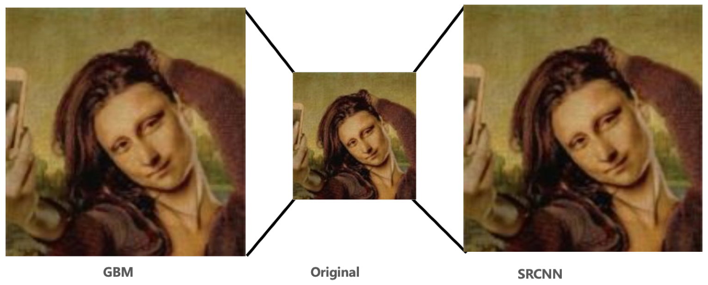
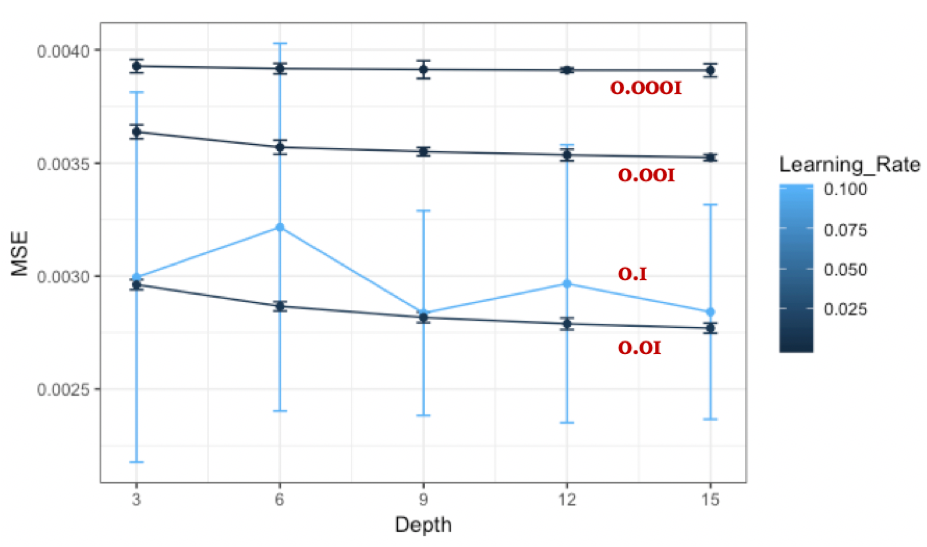
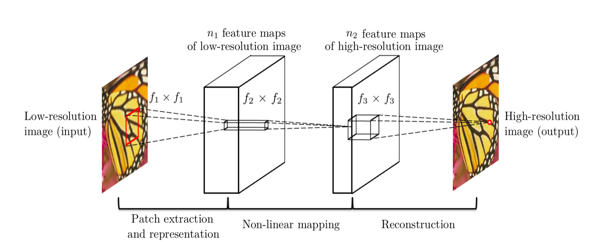
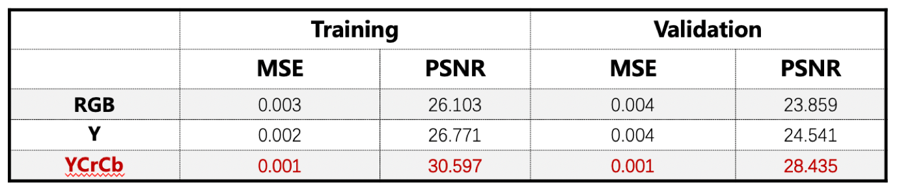
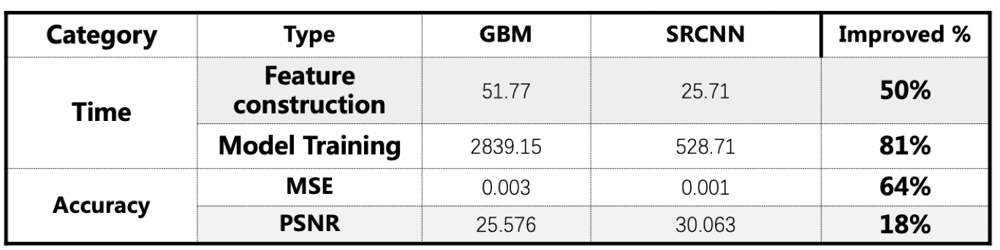

# Project: Can you unscramble a blurry image? 


   

Term: Spring 2019

+ Team #9
+ Team members
	+ Li, Yiwei (yl3950)
	+ Wu, Qianqian (qw2284)
	+ Xia, Xin (xx2295)
	+ Yin, Chao (cy2507)
	+ Zhang, Yun (yz3384)

+ Project summary: 
In this project, we created and improved the regression engines to enhance the resolution of images. The train set includes 1500 images of high resolution and low resolution, respectively. At first, we improved the baseline model (GBM) by cross validation, varying the learning rate from 0.1 to 0.0001 and we determined 0.01 to be the optimal one to use. We also changed depth from 3 to 15 and found 15 to be the best one. The training time of baseline model is more than 6 hours. The test time of baseline model is around 53 minutes. Also, we applied SRCNN algorithm to get higher resolution. We converted data of RGB into YCrCB Color type and found using YCrCB is a better choice by  Comparing two chanels.

+ Models used:
	+ Baseline: GBM
	+ Improved: deep learning(SRCNN)
	+ Unfinished: SVM, VDSR
+ GMB model improvement:
    
    
+ SRCNN model improvement:
    
    

**Model Comparison**:
    


Picture above shows the comparison in running time between the different models we utilized.

**Contribution statement**: 

+ Yiwei Li: Revised the feature extraction algorithm. Adjusted different activation functions in SRCNN (relu, sigmoid, sgn), found relu is the best choice. Wrote the Supporting Vector Machine (SVM) model and trained the model using a small sample. Tested the baseline model and Did the prediction on the test set using baseline model.

+ Qianqian Wu: Established Very Deep Super Resolution(VDSR) according to Dr. Kim's paper and trained the model with 500 samples. In SRCNN model, converted data of RGB into YCrCB Color type, since transmitting the intensity in high resolution and color in lower resolution is more efficient to save bandwidth. Compared two chanels, found using YCrCB is a better choice. Created the slides and prepared the presentation. 

+ Xin Xia: Tried baseline feature and label construction. Did cross validation and hyperparameter tuning on GBM. Designed and finished the advanced model using Super Resolution Convolution Neural Network in Python. Set up CUDA for training and testing SRCNN model.Collected low resolution images for testing the validity of SRCNN.

+ Chao Yin: Worked on Feature Extraction and SuperResolution and Completed the baseline model.Parallelized the train function for running on Google Cloud Platform efficiently. Did hyperparameter tuning on 20 groups of parameters and selected the best model for training. Collected low resolution images for testing the validity of GBM. 

+ Yun Zhang: Revised the SRCNN algorithm. Adjusted different number of layers, with the balance of running time and accuracy, choosing the model with two layers is the best. Wrote the Supporting Vector Machine (SVM) model and trained the model using a small sample. Edited the github page. Did the prediction on the test set using baseline model.


Following [suggestions](http://nicercode.github.io/blog/2013-04-05-projects/) by [RICH FITZJOHN](http://nicercode.github.io/about/#Team) (@richfitz). This folder is orgarnized as follows.

```
proj/
├── lib/
├── data/
├── doc/
├── figs/
└── output/
```

Please see each subfolder for a README file.
